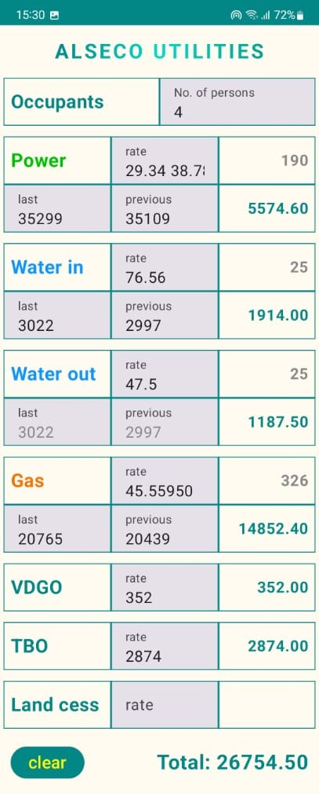
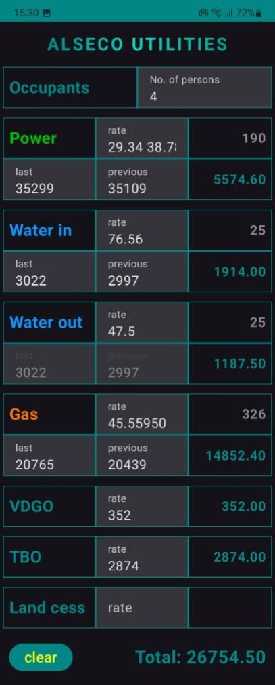

# Alseco Utilities

A handy Android application designed to streamline utility bill calculations and simplify the process of filling out payment forms.

## 📥 Download
You can download the latest version of the app here:
[🚀 Download Latest APK](https://github.com/jet-turtle/alseco-app/releases/latest)

---

## ✨ Key Features
* **Simplified Calculation**: Quick and intuitive entry of utility meter readings.
* **Smart Data Transition**: When a new billing period starts, current readings automatically move to the "previous" fields, clearing the way for new input.
* **Auto-Save**: All data is automatically saved via the `onPause` lifecycle event, ensuring no progress is lost.
* **Theme Support**: Fully optimized for both Light and Dark modes.

## 🛠 Tech Stack
* **UI**: Jetpack Compose (Declarative UI)
* **Architecture**: MVVM (Model-View-ViewModel)
* **DI**: Manual Dependency Injection (for lightweight performance and transparency)
* **Storage**: Preferences DataStore for efficient local data persistence

## 📸 Screenshots

| Light Theme | Dark Theme |
| :---: | :---: |
|  |  |

---

## 🚀 Getting Started
1. Download the APK from the [Releases](https://github.com/jet-turtle/alseco-app/releases) section.
2. Install it on your Android device (ensure "Install from Unknown Sources" is enabled).
3. Start tracking your utility bills with ease!
